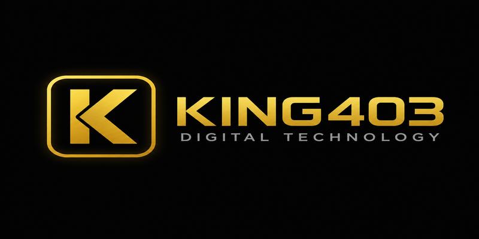

  

<h1 align="center">KING403</h1>

  <strong>Perusahaan teknologi digital · Platform · Brand · Operations</strong> 
  Indonesia · Est. 2020

  
  
  

---

## Domain Resmi

| Peran | URL |
|-------|-----|
| **Situs resmi** | [king403.it.com](https://king403.it.com/) |
| **Developer platform** | [apidevel.org](https://apidevel.org/) |
| **Portal korporat** | [king403resmi.github.io](https://king403resmi.github.io/) |
| **Profil digital** | [Peta tautan resmi](https://king403resmi.github.io/profil-digital.html) |

---

## GitHub

| Repo | Deskripsi |
|------|-----------|
| [king403resmi.github.io](https://github.com/king403resmi/king403resmi.github.io) | Portal perusahaan |
| [King403situs](https://github.com/King403situs) | Portal brand |

**Org:** [github.com/King403resmi](https://github.com/King403resmi)

---

  © KING403 · <a href="https://king403.it.com/">king403.it.com</a> · <a href="https://apidevel.org/">apidevel.org</a>

